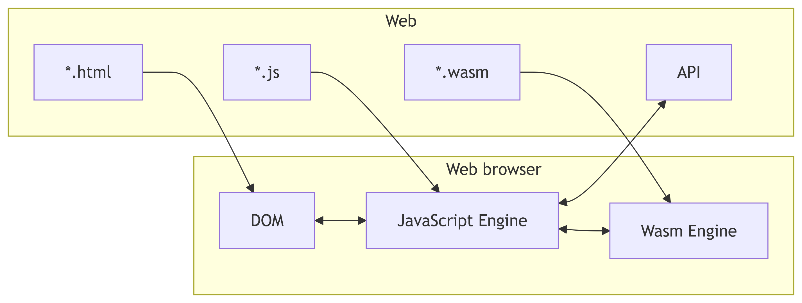
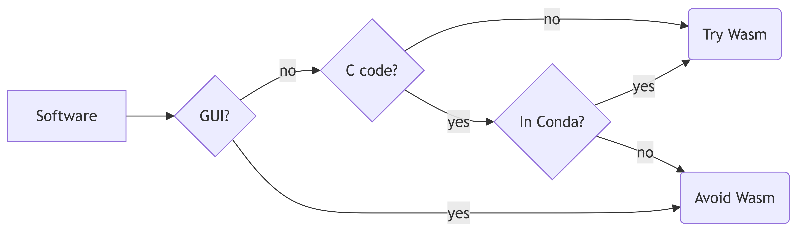

# Or "Skipping the installation" {background-image="./img/installation.jpg" background-position="center" background-opacity="0.6"}

# Brief history of World Wide Web {background-image="./img/old-pc.jpg" background-position="center" background-opacity="0.6"}

## 1989 to 1993

Tim Berners-Lee creates the first version of the Web.

It supported only [static pages](https://en.wikipedia.org/wiki/Static_web_page).

## 1994 to 2006

Introduction of [dynamic page](https://en.wikipedia.org/wiki/Dynamic_web_page).

Exploration of different technologies like

- [CSS](https://en.wikipedia.org/wiki/CSS)
- [JavaScript] and [Asynchronous JavaScript and XML](https://en.wikipedia.org/wiki/Ajax_(programming)) (AJAX)
- [Java applets] possible with [Netscape Plugin Application Programming Interface](https://en.wikipedia.org/wiki/NPAPI)
- [Flash]

## 2007 to 2016

With the launch of the iPhone, the Web moved from the personal computer to mobile devices.

Consolidation of specifications and technologies promoted under the name of [HTML5](https://en.wikipedia.org/wiki/HTML5).

[Java applets] and [Flash] were replaced with [JavaScript].

## 2017 to today

Consolidation of [software as a service](https://en.wikipedia.org/wiki/Software_as_a_service) as the main business model for services in the Web.

[JavaScript] is too slow for some applications, specially for larger applications because of the large code base that requires to be parsed by the users' web browser.

Raise in popularity of [WebAssembly] (Wasm).

# Wasm {background-image="./img/scrabble.jpg" background-position="center" background-opacity="0.6"}

## Concept

The web browser loads a binary read to be executed instead of a "human readable" script.

For safety, the loaded binary is treated as unsafe and executed in a sandbox.

## Case studies

- [Image processing in Figma](https://www.figma.com/blog/webassembly-cut-figmas-load-time-by-3x/)
- [3D modeling in Autodesk](https://www.autodesk.com/autodesk-university/class/Supercharge-Your-Browser-Based-Autodesk-Platform-Services-Applications-with-WebAssembly-2025)
- [Convert markup languages in Pandoc](https://pandoc.org/app/)
- Coding in [JupyterLite] or [notebook.link](https://notebook.link/)
- Reactive programming in [marimo](https://marimo.io/)
- [DuckDB](https://duckdb.org/docs/lts/clients/wasm/overview)
- [RunMat](https://runmat.com/)
- [Teaching Snakemake](https://github.com/snakemake/snakemake-wasm-app)

## Benefits

- Skip installation steps
- Data "never" leaves your device
- Always in a sandbox
- Cheaper to provide to users

## Limitations

- Small ecosystem
- Single thread
- Small (4GB or less) memory limit due 32-bit
- Limited network operations due enforce of same-origin
- Data persistence in the web browser powered by [Web Storage API](https://developer.mozilla.org/en-US/docs/Web/API/Web_Storage_API)
- [Support to GPU is experimental](https://developer.chrome.com/blog/io24-webassembly-webgpu-1)

## {background-image="./img/numba.png" background-position="top"}

## {background-image="./img/webgpu.png" background-position="bottom"}

## Mental model



## In research

:::: {.columns}

::: {.column width="50%"}
The R ecosystem has the [R for WebAssembly](https://github.com/r-wasm) organisation that

- compiles R to Wasm, called `webR`
- compiles some R packages to Wasm and publishes to a [CRAN-like repository](https://repo.r-wasm.org/)
:::

::: {.column width="50%"}
The team behind Python offers Wasm support, see [PEP 776](https://peps.python.org/pep-0776/), [PEP 783](https://peps.python.org/pep-0783/), and [PEP 816](https://peps.python.org/pep-0816/).

Support for web browsers is provided by

- [Pyodide](https://pyodide.org/) started at Mozilla and is now sponsored by Cloudflare, Inc.
- [PyScript](https://pyscript.net/) is backed by Anaconda, Inc.
:::

::::

## Other languages

- C and C++ via Emscripten or Clang standalone
- Fortran via C
- Rust via rustc
- Go via native support
- Kotlin via native compiling 

## Package manager

[Conda](https://en.wikipedia.org/wiki/Conda_(package_manager)) is an open-source, **cross-platform**, **language-agnostic** package manager and environment management system.

[`emscripten-forge`](https://emscripten-forge.org/) is a GitHub organization curating Conda recipes for the `emscripten-wasm32` platform. Packages are uploaded to the `emscripten-forge` channel on [prefix.dev](https://prefix.dev/channels/emscripten-forge-4x) and can be installed in a Wasm environment using [`mambajs`](https://github.com/emscripten-forge/mambajs).

## Jupyter

[JupyterLite] is a version of [JupyterLab](https://jupyterlab.readthedocs.io/) that runs entirely in the browser.

Jupyter kernels are based on [xeus](https://github.com/jupyter-xeus/xeus), a implementation of the Jupyter kernel protocol in C++. Both Python and R are supported.

# Can I use? {background-image="./img/pottery.jpg" background-position="center" background-opacity="0.6"}

## Decision tree



Contributions to [`emscripten-forge`](https://emscripten-forge.org/) (also know as Conda) are welcome!

# Examples {background-image="./img/sketching.jpg" background-position="center" background-opacity="0.6"}

## Minimal example in JavaScript

The HTML part is

```html
<h1>Example</h1>
<p>Number is <span id="number">0</span></p>
<p><button onclick="increase_number()">Increase number</button></p>
```

The JavaScript part is

```js
function increase_number() {
    number_span = document.getElementById("number");
    number = Number(number_span.innerText);
    number_span.innerText = number + 1;
}
```

## Minimal example in C

The `increase.c` file is

```c
int increase_number(int n) {
  return n + 1;
}
```

The JavaScript part is

```js
c_increase_number = Module.cwrap('increase_number', 'number', ['number'])

function increase_number() {
    number_span = document.getElementById("number");
    number = Number(number_span.innerText);
    number_span.innerText = c_increase_number(number);
}
```

## Minimal example of JavaScript in C

The `increase.c` file is

```c
#include <emscripten.h>

void increase_number() {
  int n = EM_ASM_INT({
    const number_span = document.getElementById("number");
    const number = Number(number_span.innerText);
    return number;
  });

  n = n + 1;

  EM_ASM({
    const number_span = document.getElementById("number");
    number_span.innerText = $0;
  }, n);
}
```

## Thanks!

:::: {.columns}

::: {.column width="50%"}
### Contact

✉️ [raniere@rgaiacs.com](mailto:raniere@rgaiacs.com)

🐘 [@rgaiacs@social.cologne](https://social.cologne/@rgaiacs)

💻 @rgaiacs
:::

::: {.column width="50%"}
### Resources

- [Python Everywhere](https://youtu.be/HklunTc9giA?si=5QgvpyhIvovEh_Df) at EuroPython 2026
- [Marimo WebAssembly Notebooks](https://youtu.be/cKfh5u8j2dE?si=1ZYmeJOWZ_Lpv7zA)
- [State of In-Browser ML](https://youtu.be/1_r3GqS7GK8?si=E9TtyumUx9rkGcio) at PyCon DE 2026
:::

::::

[Flash]: https://en.wikipedia.org/wiki/Adobe_Flash
[Java applets]: https://en.wikipedia.org/wiki/Java_applet
[JavaScript]: https://en.wikipedia.org/wiki/JavaScript
[JupyterLite]: https://jupyterlite.readthedocs.io/
[WebAssembly]: https://en.wikipedia.org/wiki/WebAssembly
